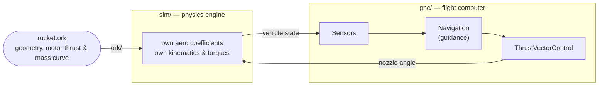
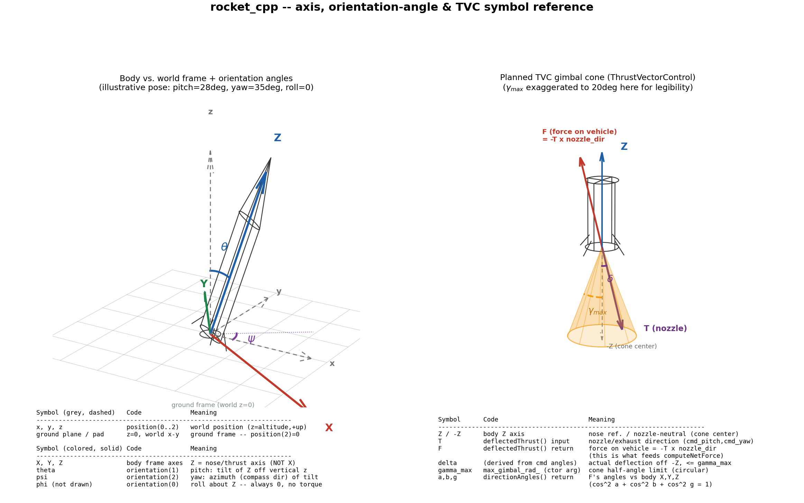
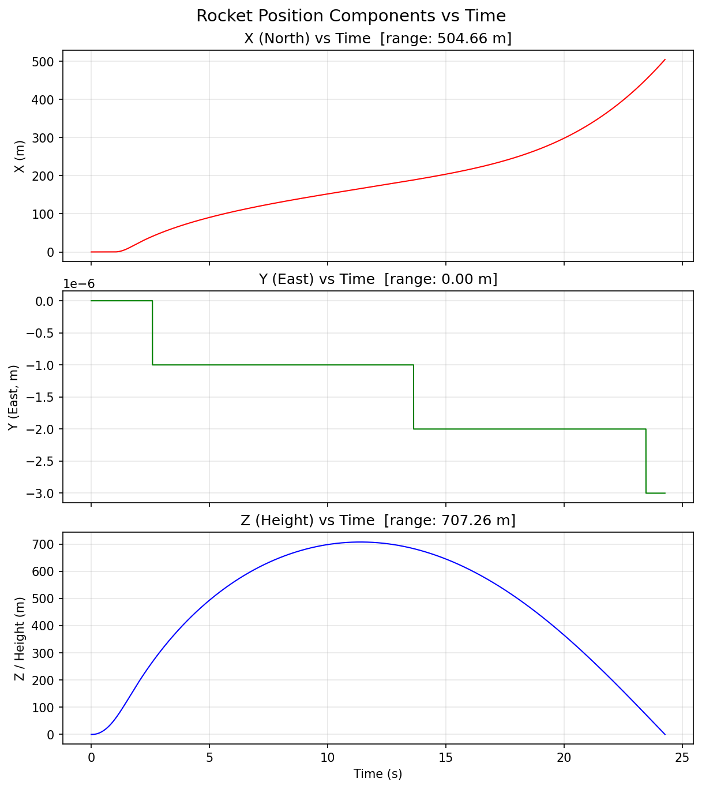

# Rocket — a from-scratch simulator for actively-guided model rockets


This repo is one project told in three layers: a **physics simulation** that
predicts how a rocket actually flies, a **flight-computer stack** (sensors +
guidance + a gimbaled nozzle) that steers it, and the **hardware** (PCB,
motor, airframe) that would eventually fly for real. The simulation
(`rocket_cpp/`) is the part that's actually working today and the focus of
this document.

If you don't have an aerospace background, that's fine — every technical
term below is explained the first time it shows up, and **[Appendix A](#appendix-a--glossary)**
is a full glossary you can jump to any time something's unclear.

## Table of contents

- [Why this project exists](#why-this-project-exists)
- [The big picture](#the-big-picture)
- [Stage 1 — `ork/`: reading the rocket back out of OpenRocket](#stage-1--ork-reading-the-rocket-back-out-of-openrocket)
- [Stage 2 — `sim/`: the physics engine](#stage-2--sim-the-physics-engine)
- [Stage 3 — `gnc/`: sensors, guidance, and the gimbal](#stage-3--gnc-sensors-guidance-and-the-gimbal)
- [What one simulated flight actually does](#what-one-simulated-flight-actually-does)
- [The hardware side](#the-hardware-side)
- [Getting started](#getting-started)
- [Honest limitations](#honest-limitations)
- [Where to go deeper](#where-to-go-deeper)
- [Appendix A — Glossary](#appendix-a--glossary)
- [Appendix B — Repository map](#appendix-b--repository-map)

## Why this project exists

[OpenRocket](https://openrocket.info/) is the standard free tool for
designing and simulating model rockets — you build up a rocket's geometry
(nose cone, body tube, fins), pick a motor, and it simulates the flight for
you. It's excellent at that. But it only simulates **passive** flight: the
rocket is a fixed shape with fixed fins, and the only thing steering it is
whatever natural aerodynamic stability that shape has. There's no way to
model a rocket that can sense its own attitude and *actively* push itself
back on course mid-flight.

That's exactly the gap this project fills. The goal was a rocket that
carries a **gimbaled** (steerable) nozzle — one that can tilt the direction
of its thrust in real time, the same basic idea SpaceX boosters use — and
a small onboard "brain" that decides, moment to moment, which way to point
it so the rocket flies toward a chosen target instead of wherever its fins
happen to point it.

Since no existing free tool simulates that, the design here uses each tool
for what it's actually good at:

- **OpenRocket** stays the design tool. The airframe geometry and motor
  choice are still built and exported there, as a `.ork` file — no reason
  to reinvent rocket CAD.
- **Everything downstream of that** — reading the design back out,
  computing how it actually flies, and closing the steering loop — is a
  custom C++ simulator (`rocket_cpp/`), built from scratch, because that
  piece genuinely didn't exist anywhere else.

## The big picture

The simulator is organized into three modules that mirror three physically
distinct jobs. Each one lives in its own folder under `rocket_cpp/include/`
and `rocket_cpp/src/`:



- **`ork/`** — a `.ork` file is really just a zip archive containing XML
  (OpenRocket's save format). This module unzips it and reads out the
  rocket's shape and its motor's thrust/mass-over-time curve.
- **`sim/`** — the **ground-truth physics engine**. Given the vehicle's
  shape and how the nozzle is currently pointed, this is what actually
  computes forces, torques, and the resulting motion, step by step.
- **`gnc/`** — short for **Guidance, Navigation, and Control**, the
  standard aerospace term for "the flight computer stack." This is the
  part that watches where the rocket is and decides how to move the
  nozzle to correct course — the actively-controlled half of the project
  that OpenRocket has no equivalent of at all.

Every step of simulated flight flows through all three: `sim/` computes
"what actually happened this instant," `gnc/` reads that and decides "what
to do next," and that decision feeds back into `sim/` for the following
step. That feedback loop — measure, decide, act, repeat — is what
**closed-loop control** means, and it's the whole reason this project
exists.

## Stage 1 — `ork/`: reading the rocket back out of OpenRocket

OpenRocket's own file format bundles everything about a design into one
`.ork` file: body dimensions, nose shape, fin geometry, and — if you've run
a simulation inside OpenRocket itself — a full time history of that flight
too.

This project only trusts **one** thing out of that file: the motor's own
**thrust curve** (thrust in newtons over time) and **mass curve** (how much
the vehicle weighs as it burns propellant). That data comes from the motor
manufacturer's own testing, not from OpenRocket's simulation, so there's no
substitute for it — a solid rocket motor's thrust profile isn't something
you can derive from first principles without literally burning one on a
test stand.

Everything else about *how the rocket flies* — drag, stability, the
turning forces air exerts on it — is deliberately **not** read from
OpenRocket's own simulated results. It's recomputed independently in
Stage 2, from the raw geometry alone. That was a real design decision, not
laziness: this project needed those numbers available live, every physics
step, responding to whatever the guidance system was doing to the vehicle
at that instant — not a fixed, pre-solved number that assumed a passive,
unguided flight.

## Stage 2 — `sim/`: the physics engine

This is the part that answers "given everything about the rocket right
now, what happens in the next instant?" It runs every simulated step and
knows nothing about guidance at all — it just faithfully computes physics
from whatever nozzle angle it's told.

**Forces.** Three things push and pull on the rocket:
- **Thrust**, from the motor, redirected by however much the nozzle is
  currently tilted (see Stage 3).
- **Drag**, opposing whatever direction the rocket is actually moving.
  Computed from **dynamic pressure** (`q = ½ρv²` — a measure of how hard
  the air is pushing, from air density `ρ` and airspeed `v`) times a drag
  coefficient.
- **Gravity**, pulling straight down, scaled by the vehicle's
  current mass (which drops as the motor burns fuel).

**Where the drag/turning coefficients come from.** The air-density and
speed-of-sound model is the **ISA** (International Standard Atmosphere —
the standard formula relating altitude to pressure, temperature, and
density). The aerodynamic coefficients themselves — how much drag, and how
much sideways "normal force," a given shape produces — come from the
**Barrowman method**, a set of formulas (from a 1966 NASA-adjacent paper
by James Barrowman) that predict a model rocket's aerodynamics directly
from its geometry: nose shape, fin count and shape, body diameter. It also
computes the **center of pressure (CP)** — the single point where all that
aerodynamic force can be treated as acting — purely from geometry.

**Why the rocket tips over on its own.** Every rigid body has a
**center of gravity (CG)** — the point where its mass balances — and, for
an aerodynamic body, that's normally in a different place than the CP. If
the two are offset and the rocket's nose isn't pointed exactly along its
direction of travel, that mismatch is called **angle of attack (α)** (in
the fore-aft plane) and **sideslip (β)** (in the left-right plane) — and
the aerodynamic force acting through the offset CP creates a **torque**
(a rotational force, a twist) around the CG that tries to swing the nose
back into the airflow. This self-correcting behavior is called
**weathercocking** — the same reason a weathervane always points into the
wind — and it's why a well-designed *passive* rocket (no guidance at all)
still flies straight. This simulation models that torque for real,
opposed by an aerodynamic **damping** torque (resistance proportional to
how fast the rocket is already rotating, so it settles instead of
oscillating forever), the same way OpenRocket's own flight model does.

**Turning that into motion.** Each step: sum the forces, divide by mass to
get acceleration, integrate that into velocity and position (a numerical
integration scheme called **Euler integration** — approximate the next
instant using the current rate of change, repeated thousands of times a
second). Sum the torques, divide by **moment of inertia** (a body's
resistance to being spun, the rotational equivalent of mass) to get
angular acceleration, and integrate that into rotation rate and
orientation (pitch and yaw **Euler angles** — the standard "tip
forward/back" and "swing left/right" attitude angles).

Translating between "the rocket's own point of view" (body frame — where
+Z is the direction the nose is pointing) and "the world's point of view"
(world frame — where +Z is straight up) is done with a rotation matrix
called a **DCM** (Direction Cosine Matrix) built from those Euler angles.
Thrust and drag are computed in the body frame (they naturally act along
and against the vehicle's own axes) and then rotated into the world frame
to actually move the rocket through space.



## Stage 3 — `gnc/`: sensors, guidance, and the gimbal

This is the layer with no OpenRocket equivalent — the part that makes
this a *controlled* rocket instead of a passive one. Three pieces, each
modeling a real physical part of a flight computer:

**Sensors** (`Gyro`, `Baro`, `Gps`) — simulated readings of the vehicle's
own true state: orientation and rotation rate (gyroscope), altitude
(barometer), and position (GPS). Today they read the simulation's own
ground truth directly, with no noise or bias modeled yet — the point is
to keep the *interface* realistic (a real flight computer can only ever
act on what its sensors report, never on the world's actual state
directly) so sensor imperfection can be layered in later without
restructuring anything above it.

**Navigation** — the guidance law. Every step, it works out the angle
between where the nose is currently pointing and the direction to the
target, and shapes that error through a **PID controller** — the standard
feedback-control building block, one of the most widely used in all of
engineering. Its three terms:
- **P** (proportional) — command is bigger when the error is bigger,
  smaller when it's smaller. The straightforward "steer toward the
  target harder the more off-course you are" behavior.
- **I** (integral) — accumulates error over time, so a small but
  *persistent* error that P alone can't fully correct still eventually
  gets cleaned up.
- **D** (derivative) — reacts to the *rate* the error is changing, to
  damp out overshoot before it happens.

In this project's tuning, **D turned out to hurt**, not help — because
the gimbal actuator (next paragraph) already has its own built-in damping
from its physical lag, so an extra derivative term on top of it just
fought the correction instead of smoothing it. That's a real finding from
testing this specific vehicle, not a rule that holds for every control
system — see [`rocket_cpp/include/gnc/navigation.hpp`](./rocket_cpp/include/gnc/navigation.hpp)
for the actual numbers. Navigation also deliberately stays off below a
minimum altitude — right off the pad, a tiny angle error would otherwise
translate into a full steering command at the worst possible moment.

**ThrustVectorControl (TVC)** — the actuator model for the nozzle itself.
Commanding a new angle doesn't make the physical nozzle teleport there; a
real servo eases toward a new position over a fraction of a second. This
is modeled as a **first-order lag** (the standard way to represent "eases
toward a target, doesn't jump") with a real travel limit (the nozzle can
only physically tilt so far). That lag is what actually produces the
thrust direction Stage 2's physics engine reads each step.

## What one simulated flight actually does

Put together, one simulated second looks like this, repeated at the
integrator's time step:

1. **Sim** computes this instant's forces/torques from the current state
   and however the nozzle is currently angled, and integrates the vehicle
   one step forward.
2. **Sensors** take a fresh reading of that new state (position,
   orientation, rotation rate).
3. **Navigation** compares that to the target and computes a new desired
   thrust direction via its PID law.
4. **TVC** eases the physical nozzle angle toward that new command by
   however far its actuator lag allows in one step.
5. Repeat, until the rocket reaches **apogee** (the highest point of the
   flight, where vertical velocity crosses zero) and comes back down to
   ground contact.

The result is written to a CSV and plotted — a full 3D trajectory, forces
over time, and the commanded vs. actual gimbal angle history:



## The hardware side

The eventual goal is for this to fly on real hardware, not just in
simulation. `artifacts/` and `kiCAD/` hold the in-progress flight-computer
PCB design — the board that would actually carry the IMU, altimeter, GPS,
and gimbal actuator this simulation's `gnc/` layer is modeling:


An earlier prototype of the trajectory math (before the C++ rewrite) was
built in MATLAB/Simulink — kept in `simulink/`/`matlab/` for history, but
superseded by `rocket_cpp/`, which is now the actively developed
simulation:


## Getting started

The simulator is a standard CMake C++ project. From `rocket_cpp/`:

```bash
cmake -S . -B build
cmake --build build
./build/rocket_cpp
```

This loads `artifacts/rocket.ork`, runs a full guided flight, and writes
`rocket_trajectory.csv` plus plots. See
**[`rocket_cpp/README.md`](./rocket_cpp/README.md)** for the full build
prerequisites and how to point it at a different `.ork`/target.

Every plotting script reads from that same `rocket_trajectory.csv`, so
they all stay in sync with whatever flight was simulated last:

| Script | What it shows | Run it |
|---|---|---|
| `scripts/plot_trajectory.py` | The 7-subplot flight-analysis figure — called automatically at the end of every `./build/rocket_cpp` run, not something you normally run by hand. | `python3 scripts/plot_trajectory.py rocket_trajectory.csv rocket_analysis.png` |
| `scripts/trajectory.py` | An interactive, rotatable 3D flight path (mouse to orbit/zoom), with launch/apogee/impact/target markers and a pass/fail readout against the target. | `python3 scripts/trajectory.py rocket_trajectory.csv` |
| `scripts/tvc.py` | The commanded gimbal angle over time, pitch and yaw axes on separate panels — what the nozzle actually did, lag included. | `python3 scripts/tvc.py rocket_trajectory.csv` |
| `scripts/x_force.py` | The net world-frame X-force over time (thrust + drag; gravity has no X-component) — useful for seeing exactly when the motor burns out. | `python3 scripts/x_force.py rocket_trajectory.csv` |
| `scripts/make_axis_diagram.py` | Regenerates the coordinate-frame/TVC reference diagram used above — a docs utility, not a per-flight plot. | `python3 scripts/make_axis_diagram.py` |

## Honest limitations

This is a staging-area project, not a finished flight-certified system.
Worth knowing before trusting any number out of it:

- **Not full 6DOF.** Roll has no torque model yet — it's tracked but never
  actively influenced by anything.
- **An inherent steering asymmetry.** Because thrust is along the body's
  own vertical axis, sideways (Y-direction) steering authority needs
  *both* pitch and yaw deflected at once, while forward (X-direction)
  steering only needs one — so the vehicle can push harder in some
  directions than others for the same actuator effort. Documented in
  detail in `rocket_cpp/README.md`'s Staging Notes.
  Structural, not a bug to be patched.
- **Yaw is under-damped** relative to pitch in the current tuning — a
  real, quantified finding, also documented in the Staging Notes.
- **Motor burn time is short.** The default demo motor (an AeroTech G61W)
  burns out in about two seconds — meaning TVC only has roughly that long
  to actually influence the trajectory before the rest of the flight is
  unpowered, ballistic coasting no gimbal command can affect. Worth
  knowing before reading too much into how "precise" any single demo run
  looks.
- **Sensors have no noise model yet.** They currently read the
  simulation's own true state directly — realistic in interface, not yet
  in behavior.

None of these are hidden — see
**[`rocket_cpp/README.md`](./rocket_cpp/README.md#staging-notes)** for the
full, current list, kept up to date as things change.

## Where to go deeper

- **[`rocket_cpp/README.md`](./rocket_cpp/README.md)** — the full
  technical reference: every class and method, the exact math behind each
  physics model, coordinate-frame conventions, build instructions, and a
  running log of bugs found and fixed along the way.
- **[`rocket_cpp/docs/axis_and_tvc_reference.png`](./rocket_cpp/docs/axis_and_tvc_reference.png)**
  — the coordinate-frame and gimbal-geometry diagram referenced above.
- Source is organized exactly along the three-module split described
  above — `rocket_cpp/include/{sim,ork,gnc}/` and
  `rocket_cpp/src/{sim,ork,gnc}/`.

## Appendix A — Glossary

Terms used throughout this document and the codebase, in plain language.

| Term | Meaning |
|---|---|
| **Angle of attack (α)** | The angle between where the nose points and the direction the vehicle is actually moving through the air, measured fore-aft. Zero when flying nose-first into the wind. |
| **Apogee** | The highest point of a flight — where vertical velocity crosses from positive (rising) to negative (falling). |
| **Barrowman method** | A set of formulas for predicting a rocket's aerodynamic coefficients (drag, stability, center of pressure) directly from its geometry, without wind-tunnel testing. |
| **Body frame** | A coordinate system attached to the rocket itself and rotating with it — "the rocket's own point of view," where its nose axis is always +Z regardless of which way the vehicle is actually pointed in the sky. |
| **CG (center of gravity)** | The single point where a body's mass balances — its "center of mass." |
| **Closed-loop control** | Continuously measuring a system's actual state and adjusting based on that measurement, as opposed to acting on a fixed, pre-planned schedule ("open-loop"). |
| **CP (center of pressure)** | The single point where the net effect of all aerodynamic forces on a body can be treated as acting. |
| **Damping** | A force or torque that resists motion in proportion to how fast that motion is already happening — what settles an oscillation down instead of letting it continue forever. |
| **DCM (Direction Cosine Matrix)** | A 3×3 rotation matrix used to convert a vector from one coordinate frame to another (e.g., body frame to world frame). |
| **DOF (degrees of freedom)** | How many independent ways a system can move. 3DOF = position in x/y/z only; 6DOF adds all three rotational axes (roll/pitch/yaw) too. |
| **Dynamic pressure (q)** | `q = ½ρv²` — a measure of how hard oncoming air pushes on a body, from air density (ρ) and airspeed (v). The basis for computing drag and other aerodynamic forces. |
| **Euler angles** | The standard roll/pitch/yaw representation of a rigid body's orientation — how far it's tipped, tilted, and turned from some reference orientation. |
| **Euler integration** | A numerical method for simulating motion: approximate what happens next using the current rate of change, over a small time step, repeated many times. |
| **First-order lag** | A system that eases toward a new target value exponentially over time rather than jumping there instantly — the standard model for how a real physical actuator (like a servo) responds to a new command. |
| **Gimbal** | A pivoting mount that lets something (here, a rocket engine's nozzle) tilt independently of the body it's attached to. |
| **GNC (Guidance, Navigation, and Control)** | The standard aerospace term for the combined sense-decide-act subsystem of a vehicle — in this project, the `gnc/` module (sensors, `Navigation`, and `ThrustVectorControl`). |
| **Integral windup** | A failure mode of the "I" term in a PID controller: if error persists for a long time (e.g., an actuator pinned at its limit), the accumulated integral can grow very large and cause a big overshoot once the error finally starts shrinking. Usually prevented by clamping the accumulator. |
| **ISA (International Standard Atmosphere)** | A standard reference model relating altitude to air pressure, temperature, and density. |
| **Moment of inertia** | A body's resistance to being rotated — the rotational equivalent of mass. |
| **Normal force** | The aerodynamic force acting perpendicular to a body's own axis (as opposed to axial force/drag, which acts along it) — what actually turns a rocket, not what slows it down. |
| **PID controller** | A feedback-control law combining Proportional (react to current error), Integral (react to accumulated past error), and Derivative (react to how fast error is changing) terms — one of the most common control algorithms in engineering. |
| **Sideslip (β)** | The same idea as angle of attack, but measured left-right instead of fore-aft. |
| **Stability margin / weathercocking** | The natural tendency of a well-designed (finned) rocket to turn its nose back into the oncoming airflow on its own, the same way a weathervane points into the wind — the reason passive, unguided rockets can fly straight at all. |
| **Torque (moment)** | A rotational force — a twist applied around some pivot point, as opposed to a straight-line push. |
| **TVC (Thrust Vector Control)** | Steering a vehicle by tilting the direction of its engine thrust, rather than (or in addition to) aerodynamic surfaces like fins. |
| **World frame** | A coordinate system fixed to the ground/launch site — "the outside observer's point of view," as opposed to the body frame, which moves and rotates with the rocket. |

## Appendix B — Repository map

```
Rocket/
├── rocket_cpp/          the simulation engine (see its own README.md)
│   ├── include/{sim,ork,gnc}/    headers, one folder per module
│   ├── src/{sim,ork,gnc}/        implementation, mirrors include/
│   ├── scripts/                  Python plotting (trajectory, TVC, forces)
│   ├── docs/                     reference diagrams
│   └── data/                     TVC test sequences, sample inputs
├── artifacts/            .ork design file, PCB renders, reference media
├── kiCAD/                flight-computer PCB design source
├── simulink/, matlab/    early prototype (superseded by rocket_cpp/)
└── data/                 shared input data (OpenRocket/motor exports)
```
